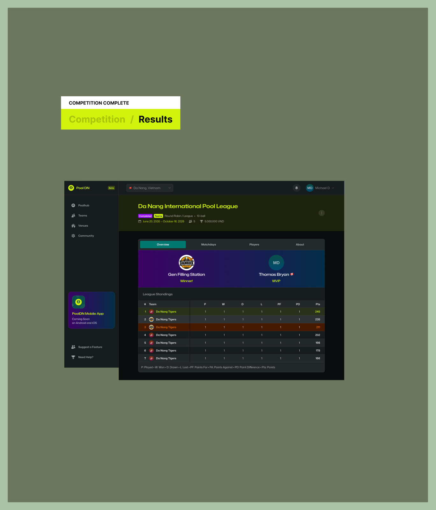

# PoolDN — Figma Design Review

> Source: [PoolDN App — Figma file `3nV5z8JLbKU8qzifEERIQM`](https://www.figma.com/design/3nV5z8JLbKU8qzifEERIQM/PoolDN-App)
> Node reviewed in depth: `493:13607` (section **"Competition Complete"**)
> Pulled: 2026-06-08
> Coverage: Full tree + tokens + screenshot for the Competition Complete section; index-level scan of the rest of the MVP page (63 desktop frames, 5 named sections).

---

## 1. Product identity

PoolDN is a **pool & billiards league-management web app**. Header strip on every screen shows brand "Pool DN" with a "Beta" badge, a city selector ("Da Nang, Vietnam"), a notification bell, and the signed-in user.

A sidebar promo card teases **"PoolDN Mobile App — Coming Soon on Android and iOS"**, so the Figma is web-first; mobile is a future deliverable not in this file.

## 2. Visual system

**Theme** is dark by default. Colors come from named variables; the ones in play on this node:

| Token              | Hex       | Role                                                |
| ------------------ | --------- | --------------------------------------------------- |
| `Mist/Mist-950`    | `#090B0C` | App background (near-black)                         |
| `Mist/Mist-900`    | `#161B1D` | Card / table background                             |
| `Mist/Mist-800`    | `#22292B` | Row hover, dividers                                 |
| `Mist/Mist-400`    | `#9CA8AB` | Muted text, table headers                           |
| `Primary/A-100`    | `#D0F30D` | Brand lime — page-title accent, winner/MVP labels, "245" winner Pts |
| `Teal/Teal-700`    | `#00786F` | Active tab fill ("Overview")                        |
| `Teal/Teal-900`    | `#0B4F4A` | Tab hover / dark teal accents                       |
| `Purple/Purple-600`| `#9810FA` | Winner + MVP hero banner gradient                   |
| `Amber/Amber-600`  | `#E17100` | Standings danger row (last place / relegation)      |
| `Amber/Amber-950`  | `#461901` | Danger row background                               |
| `White/A-100…05`   | `#FFFFFF` (with alpha) | Foreground text / overlay layers     |

**Typography** — single family: **Mona Sans**. Weight 400 (body) and 600 (titles). Documented sizes:

| Token         | Size / line-height | Use                                  |
| ------------- | ------------------ | ------------------------------------ |
| `Title/Title-2` | 28 / 34 SemiBold | Competition name ("Da Nang Intl…")   |
| `Title/Title-3` | 20 / 24 SemiBold | Section headings                     |
| `Title/Title-4` | 16 / 20 SemiBold | Card / dialog titles                 |
| `Strong/LG`     | 20 / 30 SemiBold | Emphasized body                      |
| `Strong/MD`     | 16 / 24 SemiBold | Form labels, nav items               |
| `Strong/SM`     | 14 / 20 SemiBold | Small emphasis                       |
| `Strong/XS`     | 12 / 16 SemiBold | Tags, table headers                  |
| `Body/MD`       | 16 / 24 Regular  | Default body                         |
| `Body/SM`       | 14 / 20 Regular  | Secondary text                       |

## 3. Layout primitives

- Desktop frame: **1440 × 960** with horizontal scrolling allowed below the fold.
- **Sidebar**: fixed left, **280 px** wide, full height.
- **Header**: fixed top, **1160 × 72** (sits next to the sidebar, not above it).
- **Main container**: **1160 px** wide, scrolls.
- Card spacing: 100 px outer side gutters on the league-card row, 24 px internal padding.

## 4. Information architecture

The Figma "MVP" page contains 5 logical sections and 63 individual full-page frames. Sections found:

1. **Competition Pre-Start** — competitions in draft / awaiting participants
2. **Competition Ongoing** — in-flight league management
3. **Team Captain Application** — applying as a team captain
4. **Match Flow — Captain View** — running a match (lineups, scoring, edits)
5. **Competition Complete** — final results (the node reviewed in detail)

Indicative screens / surfaces discovered across the 63 frames:

- **Auth**: Sign In, Sign Up, Welcome to PoolDN, Social Login Button
- **Onboarding / Profile**: Profile Picture, Given Name (First), Family Name (Last), Country Origin, Phone (optional), Contact Info, My Profile, Settings
- **Discovery**: Active Competitions, Upcoming Competitions, All Teams, Your Teams, Confirmed Teams, Participants, Applied (3), Invited (3)
- **Competition admin**: Create New Competition, Apply to Competition, Preview Application, Team Captain Application, Competition Details, Competition Page Title, Tournament Type, Tournament Type Selector, Round Robin / League, Format, Singles, Doubles, Game Type, 10-ball implied by status chip
- **Scheduling**: Schedule, Season Calendar, Season Start / Season End / Season Length / Season Preview, Generate Season Calendar, Weekdays, Weekly Rounds, Every Tuesday / Every Friday, Total Matchdays, Total Matches, Matches per Matchday, Max Games per Venue per Matchday, Games per Opponent, Add Weekday, Add Game Block, Matchdays
- **Match flow**: Match Layout, Match Layout Item, Match Lineups, Lineup Selector, Roster, Roster Item Selector, Select Roster, Select a Roster Captain, Submit Lineups for Next Games, Click on a Game Card to Select Winner, Winner Selector, Player MVP Rating, Opponent Requested Edit, Break
- **Teams**: Create New Team, New Team Created, Team Name, Team Size (Roster), Team Logo (optional), Team Venues, Home Venues, Captain / Roster Captain
- **Venues**: Pool Paradise (sample), Filling Station (sample), Venue Card, Home Venue (optional), Where Matches Are Played, Address, City
- **Community / Help**: Community, Suggest a Feature, Need Help?, Coming Soon

## 5. Component library (extracted from frame names)

| Category   | Components                                                                                             |
| ---------- | ------------------------------------------------------------------------------------------------------ |
| Chrome     | Header, Sidebar, Page Title, Section Title, Nav Icon                                                   |
| Inputs     | Input, Helper Text, Choice, Select, Tab List                                                            |
| Buttons    | Button, Icon Button, Social Login Button                                                                |
| Feedback   | Toast, Notification Indicator, Badge                                                                    |
| Surfaces   | Modal Header, Modal Footer, Team Card, Player Card, Venue Card, CompetitionCard, Team Match Card, Match Card Participant |
| Identity   | Avatar, Team Logo, Venue Logo, Profile Picture                                                          |
| Data       | Table Header Cell, Table Cell, Vertical Scrollbar                                                       |
| Selectors  | City Selector, Tournament Type Selector, Winner Selector, Lineup Selector, Roster Item Selector         |

These all map cleanly onto **shadcn/ui (base variant)** primitives we already scaffolded. The selectors are domain-specific compositions of `Select`/`Combobox`. Avatar/Logo/Card patterns are straight shadcn.

## 6. The "Competition Complete" node — anatomy

**Page-title strip** (above the content card, full bleed against `Mist-950`):

- H1: **"Da Nang International Pool League"** in lime (`Primary/A-100`)
- Pill row: `Completed` (purple chip), `Teams` (lime chip), then plain text `Round Robin / League • 10-ball`
- Metadata row: date range `June 20, 2026 – October 16, 2026`, participant count `👥 5`, prize `🏆 5,000,000 VND`

**Content card** (rounded, `Mist-900`):

1. **Tab list** — `Overview` (active, teal fill) · `Matchdays` · `Players` · `About`
2. **Hero band** (purple gradient, two halves):
   - Left: team logo + **"Gen Filling Station"** + **"Winner!"** lime label
   - Right: avatar + **"Thomas Bryan 🇨🇦"** + **"MVP"** lime label
3. **"League Standings"** section heading
4. **Standings table** — two-column compound layout:
   - Left fixed column (260 px): `#` (40 px) + `Team` (220 px)
   - Right scroll-ready column (700 px): `P · W · D · L · PF · PA · PD · Pts` (six 96.67 px cols + a final 120 px `Pts` col)
   - 8 rows. Row 1 highlighted **green** (winner). Row 3 highlighted **amber/red** (last? penalty? — semantic intent TBD).
5. **Legend strip** — `P: Played · W: Won · D: Drawn · L: Lost · PF: Points For · PA: Points Against · PD: Point Difference · Pts: Points`

The pattern (page-title strip + tabbed content card + nested tables) is reused across competition states (Pre-Start / Ongoing / Complete) — only the inner tab content changes.

## 7. Domain model implied by the design

These entities are needed in the Prisma schema. (Today we only have `User`.)

| Entity         | Key fields hinted at                                                                                              |
| -------------- | ----------------------------------------------------------------------------------------------------------------- |
| `User`         | name, username, email, password (✅ exists), avatar, country, phone, MVP rating                                    |
| `Team`         | name, logo, captain → User, roster size, home venues, members                                                     |
| `Venue`        | name, logo, address, city                                                                                         |
| `City`         | name, country (header scopes by city)                                                                             |
| `Competition`  | name, format (Round Robin / League), game type (10-ball, etc.), singles/doubles, status (Pre-Start / Ongoing / Complete), startDate, endDate, prize (currency-aware), maxParticipants, organizer |
| `Application`  | team → Team, competition → Competition, status (Applied / Invited / Confirmed), captain → User                    |
| `Matchday`     | competition → Competition, date, weekday, sequence                                                                |
| `Match`        | matchday, homeTeam, awayTeam, venue, winner, lineups                                                              |
| `Game`         | match, players, breaker, winner (the unit a captain clicks during "Match Flow")                                   |
| `Standing`     | competition, team, played, won, drawn, lost, pointsFor, pointsAgainst, pointDiff, points                          |
| `Notification` | user, kind, payload, readAt                                                                                       |

Standings columns map exactly to the legend (P/W/D/L/PF/PA/PD/Pts). Currency formatting needs locale support (VND is the displayed example).

## 8. Implementation notes for the Next.js app

- **Fonts**: swap the default Geist Sans/Mono in `app/layout.tsx` for **Mona Sans** via `next/font/google`.
- **CSS tokens**: register the Figma variables as Tailwind v4 CSS custom properties in `app/globals.css` under `:root` and `:dark` (the design is dark-first; the lighter section banner shows a `:light` mode exists too but the MVP focuses on dark). Map them as semantic tokens (`--color-bg`, `--color-surface`, `--color-primary`, etc.) so shadcn picks them up.
- **Layout**: build `app/(authenticated)/layout.tsx` with `Sidebar` + `Header` + content slot. Sidebar nav: Poolhub, Teams, Venues, Community.
- **Tabbing**: the competition tabs (Overview / Matchdays / Players / About) map to App Router segments: `app/competitions/[id]/(overview|matchdays|players|about)/page.tsx` — each tab becomes a route, browser back/forward works, RSC fetches just what's needed.
- **Standings**: a server component reading from GraphQL `competition(id) { standings { ... } }`. The 8-column table is naturally a CSS grid (`grid-template-columns: 40px 220px repeat(6, 96.67px) 120px`) inside an outer flex; doesn't need a heavy table library.
- **Status chips**: shadcn `<Badge>` variants — `completed` (purple), `teams` (lime), `relegation` (amber), `winner` (green). Pull colors from tokens, not literals.
- **Hero band**: a two-column flex with the purple gradient (`Purple/Purple-600` → darker tone). Reuse for analogous "result" surfaces.
- **GraphQL schema next steps**: extend the existing `User` Pothos model and add `Team`, `Venue`, `City`, `Competition`, `Match`, `Matchday`, `Standing` types + corresponding split resolvers under `lib/graphql/{types,resolvers}/`.
- **Auth boundary**: the Header carries an avatar (`Michael D.`) on every authenticated screen — auth must precede everything except the auth screens. The Sign In/Sign Up frames already exist as designs to translate.

## 9. Open questions / things this review can't answer

- Standings **row-color semantics**: green = champion (clear), red row 3 = ?? (relegation, disqualified, penalty?). Not derivable from the frame.
- **Currency**: prize is displayed in VND. Is currency per-competition, per-city, or fixed?
- **Multi-tenancy by city**: the city selector ("Da Nang, Vietnam") suggests scoped listings. Does data partition by city, or is city just a filter?
- **Permissions**: organizer / captain / player views are all present, but role-gating rules aren't visible in the design alone.
- **Mobile breakpoints**: file is desktop-only at 1440 px. Responsive rules are our call.
- **Light mode**: the page-title strip on this section uses a light background, but the dominant theme is dark. Whether full light theme is in scope is unclear.

## 10. What was NOT reviewed in this pass

- The 4 other section frames (Pre-Start, Ongoing, Team Captain Application, Match Flow Captain View) — only their names and the screens they contain were enumerated.
- The **Components** page (`11:437`) — the actual master component library was not opened. A follow-up pass should harvest it via `get_design_context` per component to drive shadcn variants and Tailwind tokens precisely.
- Interactive states, prototype links, and any auto-layout constraints on individual components.
